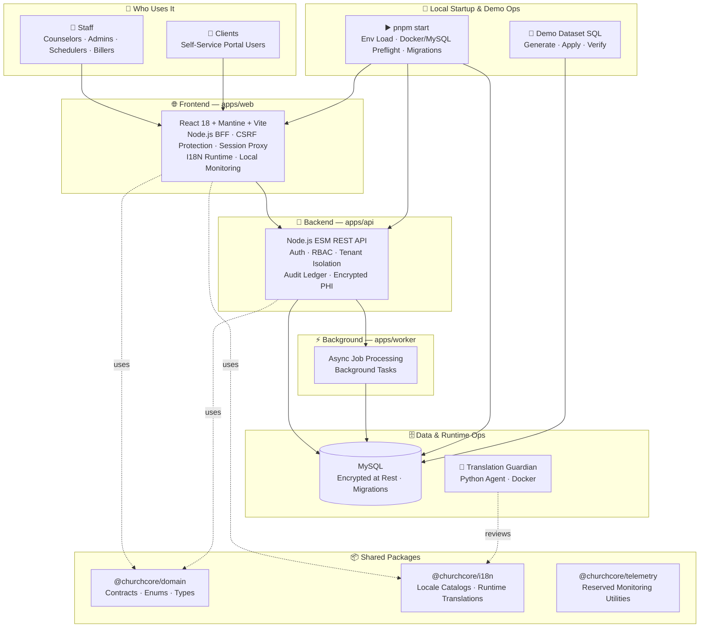

# Faith Counseling

> *"Whatever you do, work at it with all your heart, as working for the Lord."* — Colossians 3:23

Welcome to **Faith Counseling** — a practice management platform built from the ground up for Christian counseling organizations. Whether you run a solo ministry practice, a group clinic, or a multi-location operation, Faith Counseling is designed to feel like a tool made specifically for you.

From the moment a new client submits a care request to the session note signed after their last appointment, every workflow in this platform carries your practice's values forward — with structured clinical support, faith-integrated care tools, and an operational foundation ready for Monday morning.

📖 **New to the platform?** Start with the [User Manual →](docs/User%20Manual/README.md)

Want a fully loaded local tour instead of a blank shell? The repo now includes a SQL-backed demo dataset workflow, so the product you start locally can feel much closer to the product shown below.

## Faith-Based Christian Practice Focus

- designed for faith-based Christian counseling organizations and ministries
- supports optional faith-integrated care planning and counseling workflows
- preserves counselor clinical judgment while enabling Christian care context
- includes safeguards so spiritual content remains intentional, contextual, and optional where appropriate

## What This Project Is For

- running faith-based Christian counseling operations in one platform across staff and client-facing workflows
- improving counselor decision support with structured, explainable workflow guidance
- enforcing strong tenant scoping, auditability, and security boundaries
- supporting incremental product evolution with a modular monolith architecture

## Core Capabilities

- **Faithful Workflows:** counselor-facing recommendation workspace powered by 27 deterministic clinical rules across 8 care categories, with explainable rationale, trend analysis, three interchangeable canvas views (Classic List, Radial Hub, Priority Matrix), and shared operational urgency cues that keep banner counts and visible client severity aligned
- **Clinical Chart:** session notes, internal notes, treatment plans, progress tracking, and homework
- **Operations Dashboard:** live daily operations summary with counselor workload, note-gap compliance watch, portal request tracking, configurable operational alerts, and 7-day trend context
- **Workspace Studio:** full-featured practice administration hub with tabs for Practice profile, Locations CRUD, Staff roster, Lifecycle caseload board, Appointments (service codes), Documents, Offerings, and Portal workflows
- **Scheduling and operations workflows:** appointments, waitlists, reminders, utilization visibility, and a guided recurring-series builder so staff can create repeat schedules without typing raw RRULE syntax
- **Client portal workflows:** onboarding, forms, documents, and client self-service surfaces
- **Monitoring and runtime health:** built-in monitoring and operations pages with local health and database visibility
- **Security and audit foundations:** role-aware access controls and structured audit event patterns

## LATEST LOOK

The latest look feels less like a generic admin console and more like a living counseling workspace. The home experience opens with calm, high-signal surfaces: a dashboard that tells staff what needs attention now, a Faithful Workflows space that turns raw status into visible care priorities, and scheduling screens that feel built for real week-to-week ministry instead of back-office data entry.


Client and counselor records now read like story-rich working spaces rather than flat database rows. Detail views surface clinical context, faith-aware care details, diagnoses, legal and insurance context, employment and credentialing data, and practical next actions without making the user dig through disconnected tabs. The result is a product that feels organized, confident, and deeply operational at the same time.


Workspace Studio gives the platform its control-room energy. Practice settings, locations, staff, lifecycle management, documents, offerings, appointments, and portal administration all sit inside a single administration hub that feels intentional instead of crowded. It looks like the kind of system that can run an actual counseling practice on Monday morning, not just survive a demo.


The portal, charting, and monitoring views complete the picture. The client-facing side feels warm and guided, the charting side feels focused and usable, and the monitoring surfaces make the whole platform feel observable and production-minded. Put together, the current product has range: part ministry operations center, part clinical workspace, part modern practice platform, and much closer to something people would want to use every day.

Behind that presentation, the recent work has made the platform easier to trust and easier to demo. Scheduling now uses a guided recurring-series builder instead of making staff type raw recurrence syntax, dashboard and workflow counts stay visually aligned, runtime labels match the current product language, and authenticated reads stay stable even when older encrypted rows come back from MySQL in less convenient formats.

## Freshly Shipped

The platform has moved quickly over the last few iterations, and the most recent work is aimed at making Faith Counseling easier to explore, easier to operate, and easier to present with confidence.

- **Integrated telehealth via JaaS/Jitsi (Phase 1):** Remote appointments now have a live **Join Video Session** button. Clicking it calls `POST /v1/appointments/:id/video-session`, which generates a short-lived RS256 JWT and returns the JaaS room credentials. The Jitsi External API is loaded on demand and the meeting is embedded directly in the scheduling page via `VideoSessionModal`. A `session.video_started` audit event is written to the ledger on every join. JaaS room names are stable opaque tokens stored in `appointments.video_room_id` — no PHI is embedded in the room name or JWT claims. Required env vars: `JITSI_APP_ID`, `JITSI_API_KEY_ID`, `JITSI_PRIVATE_KEY_BASE64`, `JITSI_DOMAIN=8x8.vc`.

- **Client video join link (Telehealth Phase 2 — join page):** Counselors can generate a shareable join link for any session. The `VideoSessionModal` shows a "Get Client Join Link" button that calls `POST /v1/appointments/:id/client-join-token` (or the ad-hoc equivalent). The returned URL points to `/join?token=<token>` — a public, no-login page that exchanges the opaque token for a client-scoped (non-moderator) JaaS JWT and launches Jitsi. The counselor can copy the URL or click "Open in email client" to send it via their default mail app. Tokens expire in 2 hours and contain no PHI.

- **Faith-integrated clinical notes (Telehealth Phase 2):** Session notes now include a scripture reference field and checkboxes for spiritual practices (prayer journaling, scripture reading, church attendance, small group, spiritual direction, fasting, sabbath practice). All fields appear in view and edit mode of `NoteCard` and are stored as structured data on `progress_notes`.

- **Supervision cosign workflow (Telehealth Phase 3):** Intern counselors can submit locked notes for supervisor review (`pending_review`). Supervisors assigned via `supervisor_assignments` can cosign or return notes for revision. Cosign status badges appear inline on note cards. All actions are written to the audit ledger. A `supervision` appointment type is available.

- **Licensure time tracking:** Counselors and interns track direct clinical, indirect/administrative, individual/group supervision, CE/spiritual formation, and ministry coordination hours via the **Time Tracking** nav link. Supervisors can switch into assigned intern ledgers, review a pending-verification queue, and verify supervision hours so they count toward licensure goals. CSV export remains PHI-safe: it includes category, duration, hashed client reference, and supervisor verification details, but never client names, free text, or raw appointment IDs. All time entry descriptions remain AES-256-GCM encrypted at rest.

- **Cleanup tracker reconciliation:** The project hygiene tracker now matches the repository state. `PROJECT-CLEANUP.md` is listed as complete in `PLANS/PLAN-TRACKER.md`, stale mirrored agent-copy and duplicate `.venv/` references are confirmed absent, and Python cache/venv patterns remain enforced in `.gitignore`.

- **Telehealth Phase 4 SaaS infrastructure scaffolding:** Phases 1-3 of the telehealth plan are now complete and delivered (JaaS video sessions, client join links, faith-integrated clinical notes, supervision cosign workflow). Phase 4 (SaaS multi-tenant infrastructure for commercial launch) is now in active development on `feat/telehealth-phase-4-saas-infra`. Phase 4 will implement per-tenant DB pool registry, tenant provisioning API, Platform Admin app, and billing model scaffolding to support multiple customer practices in isolation.

- **Phase 4 tenant routing foundation shipped:** The API now includes a tenant-aware DB pool registry (`apps/api/src/db/pools.js`) and host-based tenant context middleware (`apps/api/src/middleware/tenant.js`). Requests run inside tenant context so DB access can resolve per-tenant pools. Strict unknown-tenant rejection is available via `TENANT_STRICT_HOST_ROUTING=true` with `TENANT_ALLOWED_SLUGS` allowlisting, while local/dev behavior remains backward compatible by default.

- **Phase 4 strict-enforcement slice shipped:** Known tenant slugs are now resolved from platform provisioning data (`tenant_provisioning`) with cache + env fallback, and unknown tenant hosts are rejected against that canonical set when strict mode is enabled. In non-local environments, enabling tenant-host routing now requires strict mode (`ENABLE_TENANT_HOST_ROUTING=true` + `TENANT_STRICT_HOST_ROUTING=true`) or the API fails fast at startup.

- **Phase 4 provisioning lifecycle slice shipped:** Tenant provisioning now uses canonical lifecycle semantics (`queued` -> `in_progress` -> `completed` or `failed`) with transition validation on `PATCH /v1/platform/tenant-provisioning`. Invalid status jumps return `409`, updates are audit-logged, and tenant activation routing treats `completed` as the canonical provisioned status. Unit tests for lifecycle helpers are now included under `apps/api/test/tenant-provisioning-lifecycle.test.mjs`.

- **Phase 4 provisioning transition endpoint tests + automation wiring shipped:** API tests now cover provisioning lifecycle endpoint behavior (`apps/api/test/tenant-provisioning-api.test.mjs`) for valid transitions, invalid transition rejection (`409`), and RBAC denial (`403`). Operational scripts now exercise the canonical transition path: `ops/step11-smoke.mjs` and `ops/step12-validate.mjs` progress provisioning requests via `PATCH`, and `ops/security-regression.mjs` verifies non-platform-admin updates are blocked.

- **Phase 4 CI/deployment policy guard shipped:** Tenant host-routing policy is now enforced in CI via `.github/workflows/tenant-policy-guard.yml` and `ops/check-tenant-policy.mjs`. The guard fails closed when non-local tenant-host routing is enabled without strict routing (`ENABLE_TENANT_HOST_ROUTING=true` requires `TENANT_STRICT_HOST_ROUTING=true`) and verifies a canonical tenant source (`TENANT_ALLOWED_SLUGS` or provisioning-backed DB mode). Operational rollout/remediation guidance is documented in `ops/runbooks/tenant-host-routing-policy.txt`.

- **Full API documentation is live (v6.0.0):** The OpenAPI spec has been fully regenerated from the actual implementation — growing from 12 documented endpoints to 150+, fixing the security scheme from Bearer JWT to the correct HttpOnly session cookie, removing phantom paths, and adding every active surface: auth, clients and all sub-resources, scheduling, billing, portal, faith features, audit intelligence, platform admin, i18n, and monitoring. Browsable at `http://localhost:3002/api/docs`.
- **Deterministic Audit Intelligence observations (v6.1.0):** The Audit Intelligence tab in Practice Operations now generates instant, rule-based callouts after every query — no AI dependency required. A 75-rule engine evaluates volume patterns, denial and error rates, authentication anomalies, PHI access concentration, admin actions, actor behavior, action distribution, and data quality gaps. Results are severity-tiered (critical → warning → info) and always available without an `ANTHROPIC_API_KEY`.
- **3-minute browser idle session timeout:** Any open browser tab now automatically invalidates the session after 3 minutes of inactivity. A dismissible warning appears at 30 seconds remaining. The server-side idle timeout has been tightened to match, providing defense in depth for PHI protection.
- **Browser error sweep is now clean:** a Playwright-driven UI scan now walks public, admin, and client surfaces against the local app, and the latest pass cleared public CSP script violations, signed-out auth noise, protected-monitoring 401s, and the Scheduling recurring-series runtime loop so the sweep finishes at `0` public, `0` admin, and `0` client errors.
- **The platform speaks like a counseling practice:** every screen title, nav label, dashboard panel, and key empty state was audited and rewritten — `My Day`, `My Tasks`, `Needs Attention`, `Caseload`, `Forms & Documents`, `Privacy & Data`, and `Welcome to Faith Counseling` at sign-in, among others.
- **A full User Manual is now live:** `docs/User Manual/README.md` walks every major role and product surface, from onboarding and scheduling to charting, monitoring, and security.
- **Demo data is now reproducible in SQL:** `pnpm demo:sql:generate`, `pnpm demo:sql:apply`, and `pnpm demo:sql:refresh` create and load the canonical dataset under `ops/demo-dataset/generated/`, which makes local demos and reset workflows much more predictable.
- **The README now shows the real product shape:** the new `LATEST LOOK` section and embedded screenshot grids turn the repository front door into an actual product tour instead of a bare technical landing page.
- **Scheduling feels more human:** recurring appointment series can now be built with readable cadence options, weekday selection, and a live preview, while raw RRULE entry remains available only as an advanced fallback.
- **Faithful Workflows stays in sync with operations:** dashboard drill-down and workflow urgency surfaces now share the same canonical counts so staff see one story, not competing numbers.

## Nightly Security Checks

The repository runs automated nightly AppSec and DB Security scans at **23:00 UTC** via GitHub Actions.

| Script | Command | Description |
| ------ | ------- | ----------- |
| AppSec scan | `node ops/appsec-scan.mjs` | 9-category application security review |
| DB Security scan | `node ops/db-security-scan.mjs` | PHI/PII encryption coverage and DB config review |
| Tenant policy guard | `node ops/check-tenant-policy.mjs` | Fail-closed tenant host-routing + provisioning flag policy validation |
| Nightly runner | `node ops/nightly-security-runner.mjs` | Orchestrator — generates dated reports in `docs/SecurityChecks/` |
| Dry run | `node ops/nightly-security-runner.mjs --dry-run` | Run scans without writing files or opening PRs |

GitHub Actions uses the root `packageManager` declaration (`pnpm@10.33.2`) as the single pnpm version source for CI, deploy, tenant-policy, and nightly security workflows.

Reports are stored in [`docs/SecurityChecks/`](./docs/SecurityChecks/) as timestamped Markdown summaries and JSON raw data.

**Current status:** AppSec `MEDIUM` (12 medium — `Math.random()` in UI key generation, deferred), DB Security `CLEAN` (0 critical/high/medium/low, PHI coverage 100%).

## Manual Security Review — 2026-04-06

A strict manual repository review is now tracked in:

- [`docs/SecurityChecks/findings.md`](./docs/SecurityChecks/findings.md)
- [`docs/SecurityChecks/recommendations.md`](./docs/SecurityChecks/recommendations.md)

Current manual review posture: **Medium risk** (reduced from High after 2026-04-06 remediation pass). The critical credential-disclosure and high reset-token exposure issues have been fixed. MFA enforcement is partially mitigated pending full TOTP/WebAuthn implementation. See the findings document for detail on open items.

## API Security And Compliance Baseline (v6.1.0)

This repository now includes a versioned API security and compliance engineering baseline for high-trust environments where sensitive data may exist.

The baseline requires secure-by-design and privacy-by-design implementation patterns across all API work, including:

- strong authentication and deny-by-default authorization
- tenant-safe object-level access controls
- strict input validation and minimal output exposure
- structured safe error handling and secrets-safe logging
- PHI/PII/payment-aware data minimization and redaction
- auditable, append-only security and data-event traceability

Canonical reference:

- `PLANS/FULL-SECURITY-AND-AUDITING.md` (includes the `v5.7.0 API Security And Compliance Engineering Standard` section)
- `PLANS/JAEGER-PROMETHEUS-OBSERVABILITY.md` (archived historical plan)

This baseline supports HIPAA-oriented safeguards, GDPR-aligned privacy principles, SOC 2 control expectations, and PCI-conscious engineering practices.

## API Documentation

The full REST API is documented as an OpenAPI 3.1 specification and is browsable interactively via Swagger UI.

| Surface | URL | Notes |
| --- | --- | --- |
| **Swagger UI** | `http://localhost:3002/api/docs` | Interactive explorer — try every endpoint in the browser |
| **OpenAPI spec (YAML)** | `http://localhost:3002/api/openapi.yaml` | Machine-readable, import into Postman, Insomnia, or any OpenAPI toolchain |
| **Source spec** | `docs/api/openapi.yaml` | Version-controlled alongside the implementation |

### What's documented

The v2.0.0 spec covers all 150+ implemented endpoints across every surface of the platform:

- **Authentication** — login, logout, session status, password change, and portal password reset
- **Clients** — full CRUD plus 11 sub-resource groups: addresses, phones, contacts, insurance, referring providers, diagnoses, medications, allergies, clinical history, faith profile, legal record, lifecycle, consents, intake packets, treatment plan, and progress notes
- **Appointments & Scheduling** — appointments, calendar, recurring series, availability overrides, utilization reports, reminders, and waitlist
- **Staff** — roster, credentials (licenses, certifications), specialty profile, employment, faith profile, and account actions
- **Practices & Locations** — practice profile and multi-location management
- **Documents** — templates and assignments
- **Forms** — catalog, assignments, submissions, and client overview
- **Inventories** — definitions and assignments
- **Billing** — invoices, payments, superbills, claims, fee schedules, service codes, and aging reports
- **Client Portal** — profile, intake packets, documents, uploads, appointment requests, messaging, resources, data rights (GDPR/CCPA), and public intake requests; counselors now see all portal activity (messages, scheduling requests, uploads) and client-entered contact preferences directly in the Client Detail view
- **Faith Features** — note templates, treatment goals, consent variants, resources, inventories, referral coordination, and language preferences
- **Offerings** — service offering catalog and summary
- **Workflows** — clinical recommendation state management
- **Audit Intelligence** — event query with statistical breakdown, and AI-powered observations (requires `ANTHROPIC_API_KEY`)
- **Reporting** — operations summary and reporting overview
- **Platform Administration** — tenant provisioning, impersonation sessions, data exports, and retention policies *(platform_admin only)*
- **Reference** — DSM-5-TR diagnosis code search
- **Internationalization** — locales, translation catalogs, settings, and auto-translate
- **Monitoring** — database health and local runtime visibility
- **System** — health probes and bootstrap metadata

### Security scheme

Authentication uses **HttpOnly session cookies**, not Bearer JWT tokens. Sign in via `POST /v1/auth/login` and the session cookie is set automatically. All subsequent requests include it automatically in the browser or via `credentials: 'include'` in fetch. The idle timeout is 3 minutes; absolute max session is 8 hours (4 hours for `platform_admin`).

### Adding `ANTHROPIC_API_KEY` for AI observations

The Audit Intelligence AI observations endpoint (`POST /v1/audit/intelligence/observations`) requires an Anthropic API key. Add it to `.env`:

```env
ANTHROPIC_API_KEY=sk-ant-...
```

Restart the API server after adding the key. The AI Observations card will appear automatically in the Audit Intelligence tab after every successful query.

## Date Picker Behavior

All `DateInput` components (Mantine v8) across the application accept dates in `MM/DD/YYYY` format for manual entry and display. The calendar popover closes automatically when a day is selected. Date values are stored internally as `YYYY-MM-DD` strings. Affected forms: intake/form runner, client demographics, legal/admin, insurance, diagnoses, employment, certifications, and licenses.

## Workspace Studio

Workspace Studio is the practice administration hub, accessible from the main navigation. It provides a tabbed interface covering all practice management surfaces:

- **Practice** — edit the practice profile: name, type (solo/group/multi-location), timezone, faith tradition, and contact information.
- **Locations** — add, edit, and delete scheduling locations. Each location tracks name, address, capacity, and telehealth/remote-enabled flag.
- **Staff** — read-only staff roster showing counselor cards (role, license type/number, supervision status, bio) and admin accounts. Links to the full Staff Management page for account creation and password resets.
- **Lifecycle** — caseload management board. Clickable status summary cards (Active, Waitlist, Inactive, Discharged) filter the client list. Referral source breakdown. Per-client status transitions with a discharge modal capturing reason and notes.
- **Appointments** — service code configuration (CPT/billing codes). Manage codes with category, default session duration, and active/inactive status.
- **Documents** — assign forms to clients and review submission history. Supports direct navigation from a client record with the client pre-selected.
- **Offerings** — track client service offerings and financial arrangements.
- **Portal** — manage portal settings, review public registration requests, approve/convert care requests into client records, and manage authenticated portal accounts.

## Client Detail Documents Shortcut

Client Detail now includes a direct header action to open documents for the active client. The action routes staff into the Client Portal Documents tab with that client preselected, so records can be viewed and document tasks can be assigned without manually switching surfaces or reselecting the client.
The checked-in public web bundle includes this shortcut so environments serving `apps/web/public` render the button without requiring local source recompilation.

## Public Web Build Artifacts

The `apps/web/public/assets` bundle files may be refreshed and committed when shipping UI workflow updates so the checked-in public web surface stays aligned with the latest source behavior.

**Note:** After UI or workflow changes (such as the SchedulingPage recurring series modal fix in v4.7.0), always rebuild the public assets with `pnpm --filter @churchcore/web build` and commit the updated bundle. This ensures that all users receive the latest code and prevents stale JavaScript errors from cached or outdated bundles.

## Standalone Product Pages

The static public surfaces are meant to reflect the current product posture, not an older generic admin-console identity. The checked-in About page at `/about` now presents Faith Counseling as a counselor-first, faith-aware practice platform with a stronger product narrative and the same light indigo visual language used across the rest of the app, while still linking back to live monitoring and API documentation.

## Architecture At A Glance

- `apps/web`: React + Mantine web UI, served by a lightweight Node server
- `apps/api`: Node.js API with MySQL persistence and migration flow
- `apps/worker`: background process surface for asynchronous work
- `packages/domain`: shared domain contracts and enums
- `packages/i18n`: localization utilities and message catalogs
- `packages/telemetry`: reserved workspace for future monitoring-related utilities
- `ops/demo-dataset`: reproducible SQL demo-data generation, apply, and verification workflow
- `pnpm start`: canonical local launcher with env loading, DB preflight, migrations, and coordinated API, web, and worker startup

## Future Ministry Integration Readiness

Faith Counseling now includes a dedicated planning artifact for future Church Management integration posture: [PLANS/CHURCH-MANAGEMENT-MINISTRY-INTEGRATION.md](PLANS/CHURCH-MANAGEMENT-MINISTRY-INTEGRATION.md).

That plan establishes the expected boundary for any upstream ministry platform, including ChurchForge:

- Faith Counseling remains a separate protected ministry system, not an internal module.
- Future integration must use APIs, webhooks, or adapters rather than direct database coupling.
- Member-to-client linkage must be consent-aware, tenant-scoped, revocable, and minimum-necessary.
- Church-side users should receive ministry-safe coordination data by default, not clinical record detail.
- AI and monitoring-related diagnostics must treat counseling data as restricted, with audit and monitoring kept privacy-safe and separate.

## Architecture Diagram



## Tech Stack

- Runtime: Node.js 20+
- Package manager: pnpm 10
- Frontend: React 18, Mantine, Vite
- Backend: Node.js (ESM), MySQL, mysql2
- E2E testing: Playwright
- Optional agent tooling: Translation Guardian via Docker Compose

## Quick Start

```bash
pnpm install
cp .env.example .env
pnpm start
```

`pnpm start` is the canonical local startup command. It now performs environment and database preflight automatically:

- loads `.env` via `node --env-file=.env`
- ensures Docker is running (launches Docker Desktop when needed)
- ensures `churchcore-postgres` is running
- waits for MySQL readiness
- runs API migration when DB is configured
- starts API, web, and worker services
- restarts existing repo-managed API, web, and worker processes on ports `3001`, `3002`, and `9465` so local changes are not served from stale long-running processes

Avoid starting the app with `node start-servers.js` for normal development, because it does not apply the full startup preflight.

## Faithful Workflows Demo Mode

Faithful Workflows now defaults to real client data only. Demo/mock workflow clients are disabled unless you explicitly turn them on.

- enable at build/start time with `VITE_ENABLE_FAITH_WORKFLOWS_DEMO=true`
- or enable in the browser with `localStorage.setItem('faith_workflows.demo_mode', 'true')` and refresh
- disable again with `localStorage.setItem('faith_workflows.demo_mode', 'false')` or by removing the key and leaving the env var unset

## Prerequisites

- Node.js >= 20
- pnpm >= 10
- Docker Desktop (required for local MySQL preflight)
- Git

## Local Setup

### 1. Install dependencies

```bash
pnpm install
```

### 2. Configure environment

```bash
cp .env.example .env
```

Update `.env` values as needed for your local environment.

Set `SEED_DEV_PORTAL_DATA=false` when you want a staff-only local database and do not want startup migration to recreate the seeded portal client/resource.

### 3. Start the full app stack

```bash
pnpm start
```

Default local endpoints:

- web: `http://127.0.0.1:3002/index.html`
- api: `http://127.0.0.1:3001`

## Alternative Local Run Commands

```bash
pnpm start:web
pnpm start:api
pnpm start:worker
```

Standalone API mode:

```bash
pnpm start:api:standalone
```

## Cloud Setup Guidance

This repository is deployment-ready, but it does not currently include opinionated production IaC templates (`infra/` is a placeholder). Use the checklist below for your target cloud environment.

### Production checklist

1. Provision managed MySQL and set production DB credentials in environment variables.
2. Set `DB_SSL=true` for encrypted database transport.
3. Provide strong secrets for:
   - `DB_ENCRYPTION_KEY`
   - `SESSION_SECRET`
4. Configure strict allowed origins in `ALLOWED_ORIGINS`.
5. Set `NODE_ENV=production`.
6. Place web/API behind TLS termination (HTTPS only).
7. Confirm monitoring and health surfaces are reachable in the deployed environment.
8. Run migrations before app startup in each environment.

### Service start commands (container or VM)

- API service: `pnpm --filter @churchcore/api start`
- Web service: `pnpm --filter @churchcore/web start`
- Worker service: `pnpm --filter @churchcore/worker start`

## Technology How-Tos

### Database migration

```bash
node --env-file=.env apps/api/src/db/migrate.js
```

### Run lint and tests

```bash
pnpm lint
pnpm test
pnpm test:security
pnpm test:e2e
pnpm test:launch-readiness
node tests/e2e/ui-error-scan.mjs
```

`node tests/e2e/ui-error-scan.mjs` drives Chromium against `http://127.0.0.1:3002` by default, signs in with the local admin and client demo accounts, and writes a page-by-page error report to `test-results/ui-error-scan.json`. Override the target with `UI_SCAN_BASE_URL` when needed.

### Load testing (k6)

Performance and load tests live in `tests/load/` and are powered by [k6](https://k6.io). They run real workflows against the live API — not mocks.

```bash
# Start the API first
pnpm start:api

# Run the full counselor workflow (composite, highest-value)
pnpm test:load:full

# Run a focused scenario
pnpm test:load:auth
pnpm test:load:intake
pnpm test:load:notes

# Run all scenarios sequentially
pnpm test:load

# Target staging with custom VU count
BASE_URL=https://staging.example.com ./tests/load/run.sh full --vus 20 --duration 3m
```

Six scenarios are available: auth, client intake, session notes, scheduling, billing, and the full composite counselor workflow. See [`docs/LOAD-TESTING.md`](docs/LOAD-TESTING.md) for the complete guide — logic, thresholds, how to run on a schedule, and how to add new scenarios.

### Demo dataset workflows

```bash
pnpm demo:sql:generate
pnpm demo:sql:apply
pnpm demo:sql:refresh
pnpm demo:verify
pnpm demo:finalize
```

Generated SQL artifacts are written to `ops/demo-dataset/generated/`:

- `demo-dataset.reset.sql`
- `demo-dataset.seed.sql`
- `demo-dataset.apply.sql`
- `demo-dataset.meta.json`

### Translation Guardian agent

```bash
pnpm agent:translation:build
pnpm agent:translation:run
```

### Local monitoring

Monitoring stays inside the application. Standard development and deployment do not require OTEL, OTLP, Jaeger, Prometheus, or browser telemetry ingestion.

Use the built-in surfaces instead:

- `/monitor.html` for runtime monitoring
- `/operations.html` for operations-oriented visibility
- `/api/health`, `/api/health/live`, and `/api/health/ready` for health probes
- `/api/v1/monitoring/db` for admin database monitoring

## Recent Updates

Only the latest entries are listed here. Full release history is in `docs/change-log.md`.

### Browser Error Sweep (April 7, 2026)

Public, admin, and client surfaces now complete a local browser error sweep without console, page, or unexpected network failures. The fix pass moved CSP-sensitive public-page startup code out of inline scripts, added an auth-aware public status check so signed-out app loads and monitoring loads stop emitting avoidable `401` noise, and repaired the Scheduling recurring-series modal so admin navigation no longer trips missing-state or max-update-depth runtime warnings.

- Scan command: `node tests/e2e/ui-error-scan.mjs`
- Output: `test-results/ui-error-scan.json`
- Latest local result: `0` public errors, `0` admin errors, `0` client errors

### Humanized UI Language (April 6, 2026)

Every screen title, page subtitle, navigation label, dashboard panel heading, and key empty state was audited and rewritten to feel natural to a Christian counseling practice rather than an enterprise SaaS back-office. No route or navigation logic was changed — only what people see.

Notable changes: `My Day` and `My Tasks` for counselors, `Today's Overview` for the admin dashboard, `Needs Attention` replacing `Priority Queue`, `Documentation Watch` replacing `Compliance Watch`, `Caseload` replacing `Lifecycle` in Workspace Studio, `Forms & Documents` replacing `Documents & Inventories`, `Privacy & Data` replacing `Data Rights` in the client portal, and `Welcome to Faith Counseling` on the sign-in screen.

### OTEL Removal (April 21, 2026)

OpenTelemetry-facing browser helpers, OTLP configuration examples, and current-facing observability documentation were removed. The monitoring baseline is now local-first and does not advertise Jaeger, Prometheus, or browser telemetry ingestion as active features.

- Monitoring plan: `PLANS/FULL-SURFACE-MONITORING.md`
- Monitoring and governance: `docs/MONITORING-AND-GOVERNANCE-FOUNDATION.md`

### User Manual (April 5, 2026)

A full 13-section end-user practice manual is now live under `docs/User Manual/`. It covers every platform surface and is organized by role — counselor, admin, scheduler, and client. Includes Getting Started, Dashboard, Client Management, Scheduling, Clinical Chart, Faithful Workflows, Workspace Studio, Client Portal, Forms, Offerings, Monitoring, Security, and Troubleshooting.

- Full manual: `docs/User Manual/README.md`

### Demo Dataset SQL Workflow (April 5, 2026)

The canonical demo dataset can now be generated as concrete SQL artifacts and loaded directly into MySQL. This gives the repo a fast, repeatable way to reset into a polished demo state with predictable records and validation.

- Commands: `pnpm demo:sql:generate`, `pnpm demo:sql:apply`, `pnpm demo:sql:refresh`
- Artifacts: `ops/demo-dataset/generated/`

### README Latest Look Refresh (April 5, 2026)

The README now includes a narrative `LATEST LOOK` section with embedded screenshot grids so new visitors see the real product surfaces immediately: dashboard, Faithful Workflows, scheduling, records, Workspace Studio, portal, charting, and monitoring.

### Guided Recurring Series Builder (April 4, 2026)

Recurring scheduling no longer starts with raw RRULE syntax. Staff now get readable cadence choices, weekday selection, and a live preview first, with advanced rule text kept available only when needed.

## Nightly Security Checks

Faith Counseling runs automated nightly security scans at **23:00 UTC** via GitHub Actions. Each run produces two complementary reports:

| Scan | What It Covers |
| ---- | -------------- |
| **AppSec** | Dependency vulnerabilities, hardcoded secrets, dangerous code patterns, security headers, auth/session configuration, input validation, logging PHI/PII exposure, CORS |
| **DB Security** | PHI/PII encryption coverage across all 73 schema tables, tenant isolation, audit table structure, session security, query parameterization, AES-256-GCM key config |

**Latest findings (2026-04-06):**

- AppSec: 🔴 HIGH — 4 high-severity and 16 medium findings, no criticals. Key items: dev credential log statements in migrate.js, `Math.random()` used in several UI components instead of crypto-secure randomness.
- DB Security: 🚨 CRITICAL — 5 critical PHI/PII fields without encryption (legacy `staff_accounts.email`, `superbills.diagnosis_codes`, provider NPI/referral_date, `tenant_provisioning.owner_email`). PHI encryption coverage: 47/52 fields (90%).

All reports are stored in [`docs/SecurityChecks/`](./docs/SecurityChecks/) and retained for 30 days. Reports are auto-committed to a `security/nightly-YYYY-MM-DD` branch with a PR opened for review.

To run scans locally:

```bash
node ops/nightly-security-runner.mjs        # full run
node ops/nightly-security-runner.mjs --dry-run  # preview without writing
```

## Change Log

For the full release and maintenance history, see `docs/change-log.md`.

The change log summarizes completed work across releases and documents the details behind updates, including new features, fixes, hardening work, and documentation-level changes where relevant.

## Documentation Index

- **Load Testing:** `docs/LOAD-TESTING.md` — k6 load test guide: scenarios, execution, thresholds, scheduling, and how to expand
- **API Documentation:** `docs/api/openapi.yaml` — OpenAPI 3.1 spec (v2.0.0), 150+ endpoints; interactive via `http://localhost:3002/api/docs`
- **User Manual:** `docs/User Manual/README.md` — full end-user guide covering all roles and platform surfaces
- Locale status docs: `docs/i18n/` — generated per-locale translation coverage and review readiness snapshots
- Product and planning overview: `docs/PRODUCT-PLANS-OVERVIEW.md`
- Domain model: `docs/domain-model.md`
- Faithful Workflows visual upgrade (v5.5.2): `docs/v5.5.2-RELEASE-SUMMARY.md`
- Faithful Workflows full feature release (v5.5.0): `docs/v5.5.0-RELEASE-SUMMARY.md`
- Operations Dashboard upgrade summary: `docs/OPERATIONS-DASHBOARD-UPGRADE-SUMMARY.md`
- Security checks and nightly reports: `docs/SecurityChecks/`
- Monitoring baseline: `PLANS/FULL-SURFACE-MONITORING.md`
- Security and auditing baseline: `PLANS/FULL-SECURITY-AND-AUDITING.md`
- Historical observability plan: `PLANS/JAEGER-PROMETHEUS-OBSERVABILITY.md`
- Monitoring and governance foundation: `docs/MONITORING-AND-GOVERNANCE-FOUNDATION.md`
- Database implementation details: `docs/DATABASE-IMPLEMENTATION.md`
- Change log: `docs/change-log.md`

## Contributing

- Create a feature branch from `main`.
- Keep changes focused and include relevant tests or validation commands.
- Enable shared repository hooks (recommended):

```bash
git config core.hooksPath .githooks
```

- Run local checks before opening a PR:

```bash
pnpm lint
pnpm test
```

- Update docs when user-visible behavior changes.
- Open a pull request with a clear summary and validation notes.

## Open Source License

This project is licensed under the MIT License.

See `LICENSE` for the full text.
