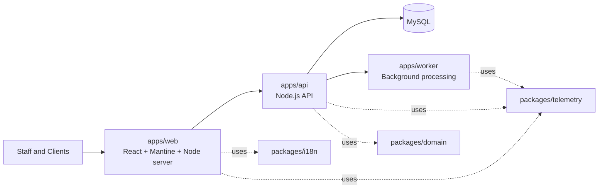

# Faith Counseling

Faith Counseling is a web-first, faith-based Christian counseling practice management platform for solo counselors, group practices, and multi-location clinics.

It is built specifically for Christian counseling practices and supports daily end-to-end workflows including client management, scheduling, clinical charting, forms, portal interactions, offerings tracking, compliance-focused operations, and observability.

## Faith-Based Christian Practice Focus

- designed for faith-based Christian counseling organizations and ministries
- supports optional faith-integrated care planning and counseling workflows
- preserves counselor clinical judgment while enabling Christian care context
- includes safeguards so spiritual content remains intentional, contextual, and optional where appropriate

## What This Project Is For

- running faith-based Christian counseling operations in one platform across staff and client-facing workflows
- improving counselor decision support with structured, explainable workflow guidance
- enforcing strong tenant scoping, auditability, and security boundaries
- supporting incremental product evolution with a modular monolith architecture

## Core Capabilities

- Faithful Workflows: counselor-facing recommendation workspace powered by deterministic clinical rules
- Clinical Chart: session notes, internal notes, treatment plans, progress tracking, and homework
- Scheduling and operations workflows: appointments, waitlists, reminders, and utilization visibility
- Client portal workflows: onboarding, forms, documents, and client self-service surfaces
- Monitoring and telemetry: local monitoring + optional OpenTelemetry export
- Security and audit foundations: role-aware access controls and structured audit event patterns

## API Security And Compliance Baseline (v5.6.0)

This repository now includes a versioned API security and compliance engineering baseline for high-trust environments where sensitive data may exist.

The baseline requires secure-by-design and privacy-by-design implementation patterns across all API work, including:

- strong authentication and deny-by-default authorization
- tenant-safe object-level access controls
- strict input validation and minimal output exposure
- structured safe error handling and secrets-safe logging
- PHI/PII/payment-aware data minimization and redaction
- auditable, append-only security and data-event traceability

Canonical reference:

- `PLANS/FULL-SECURITY-AND-AUDITING.md` (includes the `v5.6.0 API Security And Compliance Engineering Standard` section)

This baseline supports HIPAA-oriented safeguards, GDPR-aligned privacy principles, SOC 2 control expectations, and PCI-conscious engineering practices.

## Architecture At A Glance

- `apps/web`: React + Mantine web UI, served by a lightweight Node server
- `apps/api`: Node.js API with MySQL persistence and migration flow
- `apps/worker`: background process surface for asynchronous work
- `packages/domain`: shared domain contracts and enums
- `packages/i18n`: localization utilities and message catalogs
- `packages/telemetry`: shared telemetry and monitoring utilities

## Architecture Diagram



## Tech Stack

- Runtime: Node.js 20+
- Package manager: pnpm 10
- Frontend: React 18, Mantine, Vite
- Backend: Node.js (ESM), MySQL, mysql2
- E2E testing: Playwright
- Optional agent tooling: Translation Guardian via Docker Compose

## Quick Start

```bash
pnpm install
cp .env.example .env
docker compose up -d
node --env-file=.env apps/api/src/db/migrate.js
pnpm start
```

## Prerequisites

- Node.js >= 20
- pnpm >= 10
- Docker (recommended for local MySQL)
- Git

## Local Setup

### 1. Install dependencies

```bash
pnpm install
```

### 2. Configure environment

```bash
cp .env.example .env
```

Update `.env` values as needed for your local environment.

### 3. Start MySQL (recommended)

```bash
docker compose up -d
```

### 4. Run database migration

```bash
node --env-file=.env apps/api/src/db/migrate.js
```

### 5. Start the full app stack

```bash
pnpm start
```

Default local endpoints:

- web: `http://localhost:3000` (or configured web port)
- api: `http://localhost:3001` (from `PORT`)

## Alternative Local Run Commands

```bash
pnpm start:web
pnpm start:api
pnpm start:worker
```

Standalone API mode:

```bash
pnpm start:api:standalone
```

## Cloud Setup Guidance

This repository is deployment-ready, but it does not currently include opinionated production IaC templates (`infra/` is a placeholder). Use the checklist below for your target cloud environment.

### Production checklist

1. Provision managed MySQL and set production DB credentials in environment variables.
2. Set `DB_SSL=true` for encrypted database transport.
3. Provide strong secrets for:
   - `DB_ENCRYPTION_KEY`
   - `SESSION_SECRET`
4. Configure strict allowed origins in `ALLOWED_ORIGINS`.
5. Set `NODE_ENV=production`.
6. Place web/API behind TLS termination (HTTPS only).
7. Configure an optional OTEL endpoint if centralized observability is required.
8. Run migrations before app startup in each environment.

### Service start commands (container or VM)

- API service: `pnpm --filter @faith/api start`
- Web service: `pnpm --filter @faith/web start`
- Worker service: `pnpm --filter @faith/worker start`

## Technology How-Tos

### Database migration

```bash
node --env-file=.env apps/api/src/db/migrate.js
```

### Run lint and tests

```bash
pnpm lint
pnpm test
pnpm test:security
pnpm test:e2e
pnpm test:launch-readiness
```

### Demo dataset workflows

```bash
pnpm demo:verify
pnpm demo:finalize
```

### Translation Guardian agent

```bash
pnpm agent:translation:build
pnpm agent:translation:run
```

### Optional telemetry export (OpenTelemetry)

Set:

- `OTEL_EXPORTER_OTLP_ENDPOINT`
- `OTEL_SERVICE_NAME`

If `OTEL_EXPORTER_OTLP_ENDPOINT` is unset, telemetry remains local/console-only.

## Recent Updates

Only the latest two releases are listed here. Full release history is in `docs/change-log.md`.

### v5.5.0 (March 31, 2026)

Faithful Workflows release: introduced a counselor-facing recommendation workspace with deterministic rules, explainable rationales, and enriched canonical demo-data wiring.

- Full summary: `docs/v5.5.0-RELEASE-SUMMARY.md`

### v5.4.2 (March 31, 2026)

Operations Studio stabilization update: removed non-representative AR display and fixed a cache-related runtime mismatch in operations assets.

- Full summary: `docs/v5.4.2-RELEASE-SUMMARY.md`

## Documentation Index

- Product and planning overview: `docs/PRODUCT-PLANS-OVERVIEW.md`
- Domain model: `docs/domain-model.md`
- Monitoring baseline: `PLANS/FULL-SURFACE-MONITORING.md`
- Security and auditing baseline: `PLANS/FULL-SECURITY-AND-AUDITING.md`
- Database implementation details: `docs/DATABASE-IMPLEMENTATION.md`
- Change log: `docs/change-log.md`

## Contributing

1. Create a feature branch from `main`.
2. Keep changes focused and include relevant tests or validation commands.
3. Run local checks before opening a PR:

```bash
pnpm lint
pnpm test
```

1. Update docs when user-visible behavior changes.
2. Open a pull request with a clear summary and validation notes.

## Open Source License

This project is licensed under the MIT License.

See `LICENSE` for the full text.
